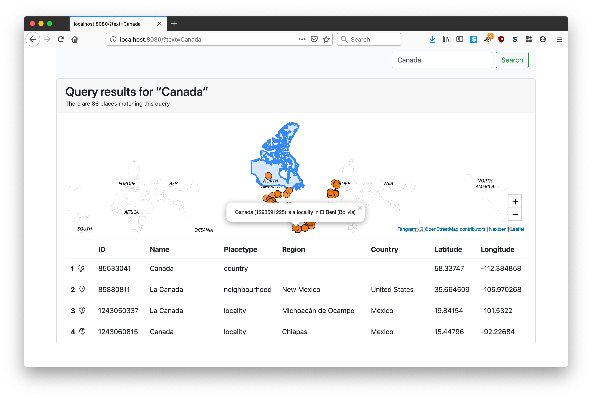

# go-placeholder-client-www



Too soon. Move along.

## AWS


### Lambda

This assumes you are running `cmd/server/main.go` as a Lambda function and connecting to an instance of Placeholder running inside ECS Fargate instance.

#### Roles

You will need a `IAM` role with the following (AWS managed) policies:

* `AWSLambdaBasicExecutionRole`
* `AWSLambdaVPCAccessExecutionRole`

#### VPC

_Please write me._

#### Environment variables

| Key | Value | Notes |
| --- | --- | --- |
| PLACEHOLDER_PROTOCOL | `lambda` |
| PLACEHOLDER_PLACEHOLDER_ENDPOINT | ... |
| PLACEHOLDER_STATIC_PREFIX | ... |
| PLACEHOLDER_NEXZEN_APIKEY | ... |

_Please write about `PLACEHOLDER_STATIC_PREFIX`._

### ECS

There is also a handy [Dockerfile](Dockerfile) for running things in a container. The following assumes that you want to run the `placeholder-client-www` server in AWS as a Fargate deployment with application load balancer (ALB) in front of it.

```
/usr/local/bin/placeholder-client-www,-placeholder-endpoint,{PLACEHOLDER_ENDPOINT},-host,0.0.0.0,-nextzen-apikey,{NEXTZEN_APIKEY}
```

Note the `-host 0.0.0.0` part. This is important. Without it the health checks performed by ALB will always fail.

## See also

* https://github.com/sfomuseum/go-placeholder-client
* https://github.com/sfomuseum/docker-placeholder
* https://github.com/pelias/placeholder/
