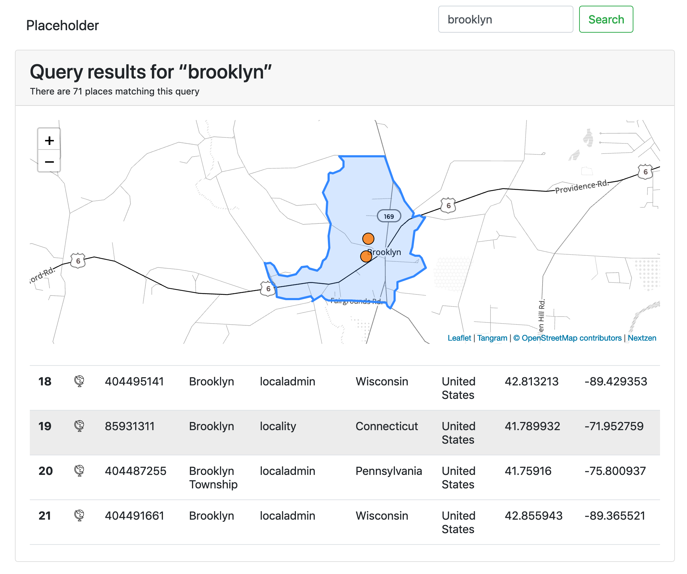
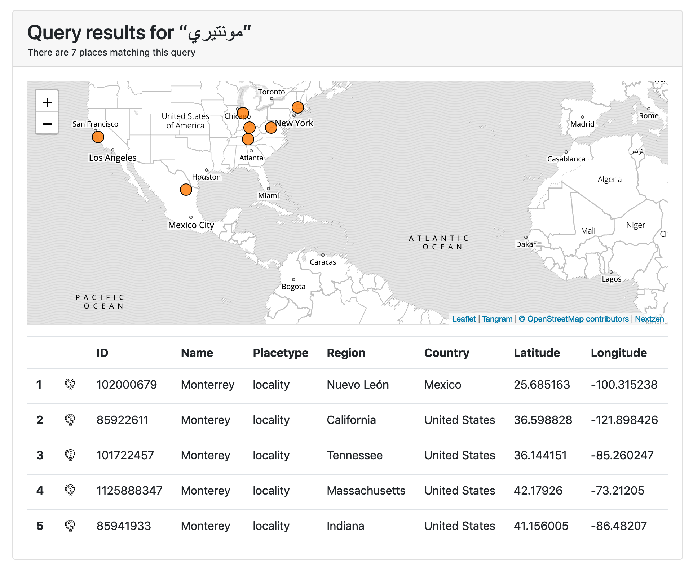
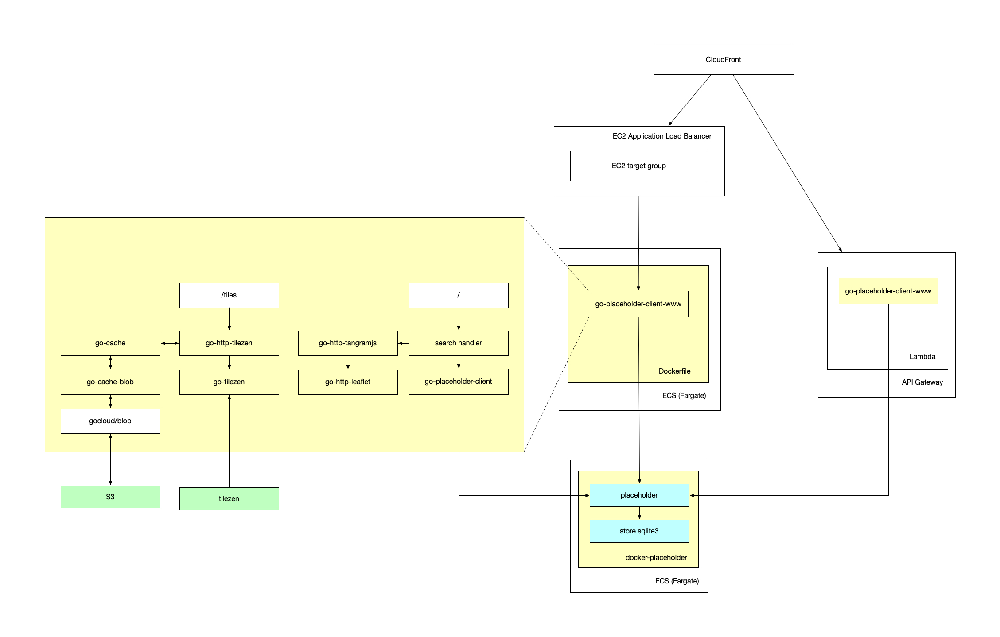

# go-placeholder-client-www





This is a Go package that provides a simple web application for querying a (Pelias) [Placeholder](https://github.com/pelias/placeholder/) server and uses Bootstrap, Leaflet, TangramJS and Nextzen tiles to render pages and maps. All (JavaScript and CSS) assets are bundled locally with the application and it is possible to configure the application to serve and cache local copies of Nextzen tiles.

The application will import and overlay Who's On First data for query results. As of this writing those resources can not be cached or served locally.

## Important

This is work in progress. It works but the documentation is not complete. There are also [a number of known-known UI/UX issues](https://github.com/sfomuseum/go-placeholder-client-www/issues?q=is%3Aissue+is%3Aopen+label%3Aui%2Fux) that remain to be addressed.

## Tools

### server

```
$> server -h
Usage of server:
  -api
    	Enable an API endpoint for Placeholder functionality.
  -api-url string
    	The URL (a relative path) for the API endpoint. (default "/api/")
  -cors
    	Enable CORS support for the API endpoint.
  -cors-origin value
    	One or more hosts to restrict CORS support to on the API endpoint. If no origins are defined (and -cors is enabled) then the server will default to all hosts.	
  -host string
    	The host to listen for requests on. (default "localhost")
  -nextzen-apikey string
    	A valid Nextzen API key
  -nextzen-style-url string
    	... (default "/tangram/refill-style.zip")
  -nextzen-tile-url string
    	... (default "https://{s}.tile.nextzen.org/tilezen/vector/v1/512/all/{z}/{x}/{y}.mvt")
  -placeholder-endpoint string
    	The address of the Placeholder endpoint to query. (default "http://localhost:3000")
  -port int
    	The port to listen for requests on. (default 8080)
  -protocol string
    	The protocol for placeholder-client server to listen on. Valid protocols are: http, lambda. (default "http")
  -proxy-test-network
    	Ensure outbound network connectivity for proxy tiles
  -proxy-tiles
    	Proxy (and cache) Nextzen tiles.
  -proxy-tiles-dsn string
    	A valid tile proxy DSN string. (default "cache=gocache")
  -proxy-tiles-timeout int
    	The maximum number of seconds to allow for fetching a tile from the proxy. (default 30)
  -proxy-tiles-url string
    	The URL (a relative path) for proxied tiles. (default "/tiles/")
  -static-prefix string
    	Prepend this prefix to URLs for static assets.
  -templates string
    	An optional string for local templates. This is anything that can be read by the 'templates.ParseGlob' method.
```

For example

```
go run -mod vendor cmd/server/main.go \
	-nextzen-apikey {NEXTZEN_APIKEY} \
	-proxy-tiles
	-proxy-tiles-dsn 'cache=blob blob=s3://{S3_BUCKET}?region={S3_REGION}&credentials={AWS_CREDENTIALS'
```

## AWS



This diagram represents the earliest attempts to get this working in AWS. It does work but requires a non-trivial setup and still has a number of AWS-related issues (described below) that make the whole thing a bit of a nuisance.

It describes two different setups:

### Lambda + API Gateway + CloudFront

This setup runs the `server` tool as a Lambda function fronted by an API Gateway that is, in turn, fronted by a CloudFront distribution.

The problem with this setup is that, pending patches to the way that `Tangram.js` issues `Fetch` requests (naming passing along an HTTP `Accept` header) there is no way to tell API Gateway to return zipped scene file (map styles) bundled in the `go-http-tangramjs` handler) as binary data which confuses the map renderer something fierce. The only option here is to use remote scenefiles hosted on the Nextzen website.

### ECS Fargate + CloudFront

This setup runs the `server` as a long-running process in an ECS (Fargate) container, fronted by a CloudFront distribution.

The problem with this set up is that in order to cache (read or write) Nextzen tiles to a local S3 bucket you need to do some AWS VPC hoop-jumping to allow you to retrieve both local AWS resources (S3) _and_ things out on the internet (source tiles from Nextzen). It's possible but it requires a lot of button-pressing and I haven't figured it out yet...

The documentation that follows is specific to the first scenario (Lambda + API Gateway + CloudFront). Documentation for the second scenario (ECS Fargate + CloudFront) still needs to be written.

### Lambda

This assumes you are running `cmd/server/main.go` as a Lambda function and connecting to an instance of Placeholder running inside ECS Fargate instance.

#### Roles

You will need a `IAM` role with the following (AWS managed) policies:

* `AWSLambdaBasicExecutionRole`
* `AWSLambdaVPCAccessExecutionRole`

#### VPC

_Please write me._

#### Environment variables

| Key | Value | Required |
| --- | --- | --- |
| PLACEHOLDER_PROTOCOL | `lambda` | yes |
| PLACEHOLDER_PLACEHOLDER_ENDPOINT | string | yes |
| PLACEHOLDER_NEXZEN_APIKEY | string | yes | 
| PLACEHOLDER_STATIC_PREFIX | string | no |
| PLACEHOLDER_API | boolean | no |
| PLACEHOLDER_CORS | boolean | no |
| PLACEHOLDER_CORS_ORIGIN | string | no |
| PLACEHOLDER_NEXTZEN_STYLE_URL | string | no |
| PLACEHOLDER_PROXY_TILES | boolean | no |
| PLACEHOLDER_PROXY_TILES_DSN | string | no |

#### Nextzen style URLs in a Lambda context

Assuming you're accessing this Lambda function through an API Gateway endpoint you will need to specify an externally hosted Tilezen style for the `PLACEHOLDER_NEXTZEN_STYLE_URL` environment variable. Something like: `https://www.nextzen.org/carto/refill-style/refill-style.zip`

The reasons for this is that by default API Gateway returns data as plain or base-64 encoded text. It is possible to configure API Gateway to return binary data but this is dependent on the client _requesting_ the data to pass along an HTTP `Accept` header. In this case that means Tangram.js needs to request style bundles as `Accept: application/zip` which it doesn't as of this writing.

Pending an update to Tangram.js there are some possible alternatives (to allow using local Tangram styles) but they are still being investigated.

#### Proxying tiles in a Lambda context

Assuming you're connecting to a Placeholder endpoint running in an ECS instance (using the `docker-placeholder` container) then you will have had to set up your Lambda function inside a VPC (see above). Once you've done that your Lambda function will no longer be able to reach the external internet without adding a NAT gateway to your VPC. If you haven't done that then, unless you've pre-seeded all the tiles you're going to request, the tile proxy layer won't work because the proxy will never be able to fetch tiles from S3 let alone Nextzen (aka: the external internet).

### ECS

There is also a handy [Dockerfile](Dockerfile) for running things in a container. The following assumes that you want to run the `placeholder-client-www` server in AWS as a Fargate deployment with application load balancer (ALB) in front of it.

```
/usr/local/bin/placeholder-client-www,-placeholder-endpoint,{PLACEHOLDER_ENDPOINT},-host,0.0.0.0,-nextzen-apikey,{NEXTZEN_APIKEY}
```

Note the `-host 0.0.0.0` part. This is important. Without it the health checks performed by ALB will always fail.

## See also

* https://github.com/sfomuseum/go-placeholder-client
* https://github.com/sfomuseum/docker-placeholder
* https://github.com/pelias/placeholder/

## See also-er

* https://github.com/aaronland/go-http-tangramjs
* https://github.com/aaronland/go-http-leaflet
* https://github.com/sfomuseum/go-http-tilezen